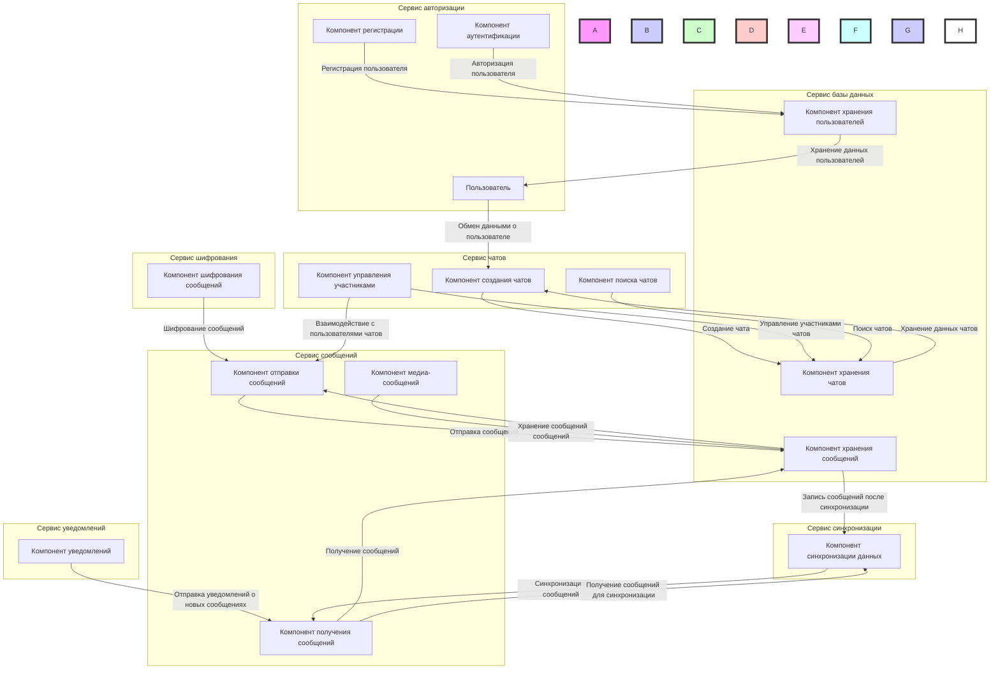

```mermaid
%% Bounded Context Diagram: Сервисы чата

graph TD
    style A fill:#f9f,stroke:#333,stroke-width:4px
    style B fill:#ccf,stroke:#333,stroke-width:4px
    style C fill:#cfc,stroke:#333,stroke-width:4px
    style D fill:#fcc,stroke:#333,stroke-width:4px
    style E fill:#fcf,stroke:#333,stroke-width:4px
    style F fill:#cff,stroke:#333,stroke-width:4px
    style G fill:#ccf,stroke:#333,stroke-width:4px
    style H fill:#fff,stroke:#333,stroke-width:4px

    subgraph "Сервис авторизации"
        direction TB
        A1[Пользователь]
        A2[Компонент регистрации]
        A3[Компонент аутентификации]
    end

    subgraph "Сервис чатов"
        direction TB
        B1[Компонент создания чатов]
        B2[Компонент управления участниками]
        B3[Компонент поиска чатов]
    end

    subgraph "Сервис сообщений"
        direction TB
        C1[Компонент отправки сообщений]
        C2[Компонент получения сообщений]
        C3[Компонент медиа-сообщений]
    end

    subgraph "Сервис уведомлений"
        direction TB
        D1[Компонент уведомлений]
    end

    subgraph "Сервис шифрования"
        direction TB
        E1[Компонент шифрования сообщений]
    end

    subgraph "Сервис синхронизации"
        direction TB
        F1[Компонент синхронизации данных]
    end

    subgraph "Сервис базы данных"
        direction TB
        G1[Компонент хранения пользователей]
        G2[Компонент хранения чатов]
        G3[Компонент хранения сообщений]
    end

    %% Взаимодействие между сервисами
    A2 -->|Регистрация пользователя| G1
    A3 -->|Авторизация пользователя| G1
    B1 -->|Создание чата| G2
    B2 -->|Управление участниками чатов| G2
    B3 -->|Поиск чатов| G2
    C1 -->|Отправка сообщений| G3
    C2 -->|Получение сообщений| G3
    C3 -->|Обработка медиа-сообщений| G3
    D1 -->|Отправка уведомлений о новых сообщениях| C2
    E1 -->|Шифрование сообщений| C1
    F1 -->|Синхронизация сообщений| C2
    G1 -->|Хранение данных пользователей| A1
    G2 -->|Хранение данных чатов| B1
    G3 -->|Хранение сообщений| C1

    %% Стрелки для связи между сервисами
    A1 -->|Обмен данными о пользователе| B1
    B2 -->|Взаимодействие с пользователями чатов| C1
    C2 -->|Получение сообщений для синхронизации| F1
    G3 -->|Запись сообщений после синхронизации| F1

```