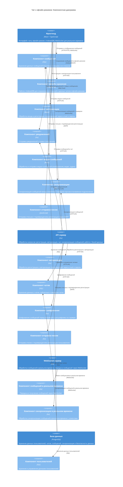

## C4 Component Diagram чата с офлайн-режимом

```mermaid
%% C4 Component Diagram: Чат с офлайн-режимом (с учетом всех требований)

C4Component
    title Чат с офлайн-режимом: Компонентная диаграмма

    Container(webApp, "Фронтенд", "React + TypeScript", "Интерфейс чата, офлайн-режим с IndexedDB, WebSocket для реального времени")
    Component(messageComponent, "Компонент сообщений", "React", "Отображает и отправляет сообщения в чате, поддержка медиа-сообщений")
    Component(offlineStorageComponent, "Компонент офлайн-хранения", "JavaScript", "Работа с IndexedDB для сохранения сообщений и данных чатов в офлайн-режиме")
    Component(userAuthComponent, "Компонент авторизации", "React", "Обработка входа и регистрации пользователей через e-mail и пароль")
    Component(pushNotificationComponent, "Компонент уведомлений", "JavaScript", "Отправка Web Push уведомлений о новых сообщениях")
    Component(mediaComponent, "Компонент медиа-сообщений", "React", "Обработка и отправка медиа-сообщений (изображения, видео, аудио)")
    Component(syncComponent, "Компонент синхронизации", "JavaScript", "Синхронизация сообщений между сервером и клиентом при восстановлении соединения")
    Component(emailComponent, "Компонент отправки писем", "JavaScript", "Отправка письма с подтверждением регистрации через SMTP")

    Container(apiServer, "API сервер", "Go", "Обработка запросов: регистрация, авторизация, чат, синхронизация сообщений, работа с базой данных")
    Component(authComponent, "Компонент авторизации", "Go", "Обработка регистрации и авторизации пользователей через e-mail и пароль")
    Component(chatComponent, "Компонент чатов", "Go", "Создание и управление чатами (публичные и закрытые), добавление участников")
    Component(messageComponent, "Компонент сообщений", "Go", "Обработка отправки, получения и синхронизации сообщений")
    Component(pushNotificationComponent, "Компонент уведомлений", "Go", "Отправка уведомлений о новых сообщениях")
    Component(encryptionComponent, "Компонент шифрования", "Go", "Шифрование сообщений перед отправкой и расшифровка на сервере")
    Component(syncComponent, "Компонент синхронизации", "Go", "Синхронизация сообщений между клиентом и сервером при восстановлении подключения")
    Component(emailServiceComponent, "Компонент отправки писем", "Go", "Отправка писем с подтверждением регистрации пользователю")

    Container(webSocketServer, "WebSocket сервер", "Go", "Обработка сообщений в реальном времени, передача сообщений через WebSocket")
    Component(realTimeMessageComponent, "Компонент сообщений в реальном времени", "Go", "Передача и получение сообщений через WebSocket")
    Component(syncRealTimeComponent, "Компонент синхронизации в реальном времени", "Go", "Обработка синхронизации сообщений в реальном времени с клиентами")

    Container(database, "База данных", "PostgreSQL", "Хранение данных пользователей, чатов, сообщений, синхронизация и безопасность данных")
    Component(userComponent, "Компонент пользователей", "SQL", "Хранение и управление данными пользователей")
    Component(chatComponent, "Компонент чатов", "SQL", "Хранение данных о чатах, публичных и закрытых чатах")
    Component(messageComponent, "Компонент сообщений", "SQL", "Хранение данных сообщений (текстовых и медиа) и их статусов")

    Rel(webApp, messageComponent, "Отправка и отображение сообщений", "HTTP/HTTPS, WebSocket")
    Rel(webApp, offlineStorageComponent, "Сохранение сообщений в офлайн-режиме", "IndexedDB API")
    Rel(webApp, userAuthComponent, "Регистрация и авторизация пользователя", "HTTP API")
    Rel(webApp, pushNotificationComponent, "Получение уведомлений о новых сообщениях", "Web Push")
    Rel(webApp, mediaComponent, "Отправка медиа-сообщений", "HTTP API")
    Rel(webApp, syncComponent, "Синхронизация сообщений с сервером", "WebSocket")
    Rel(webApp, emailComponent, "Отправка письма с подтверждением регистрации", "SMTP")

    Rel(apiServer, authComponent, "Обработка регистрации и авторизации", "HTTP API")
    Rel(apiServer, chatComponent, "Создание и управление чатами", "HTTP API")
    Rel(apiServer, messageComponent, "Отправка сообщений в чат", "HTTP API")
    Rel(apiServer, pushNotificationComponent, "Отправка уведомлений", "Web Push API")
    Rel(apiServer, encryptionComponent, "Шифрование сообщений", "HTTP API")
    Rel(apiServer, syncComponent, "Синхронизация сообщений", "HTTP API")
    Rel(apiServer, emailServiceComponent, "Отправка письма с подтверждением регистрации", "SMTP")

    Rel(webSocketServer, realTimeMessageComponent, "Обмен сообщениями в реальном времени", "WebSocket")
    Rel(webSocketServer, syncRealTimeComponent, "Синхронизация сообщений в реальном времени", "WebSocket")

    Rel(database, userComponent, "Хранение данных пользователей", "SQL")
    Rel(database, chatComponent, "Хранение данных чатов", "SQL")
    Rel(database, messageComponent, "Хранение сообщений", "SQL")

```