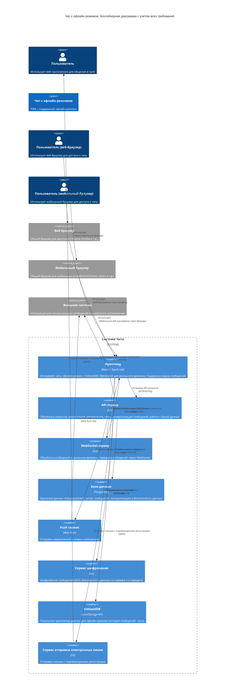

## C4 Container Diagram чата с офлайн-режимом

```mermaid
%% C4 Container Diagram: Чат с офлайн-режимом (с учетом веб и мобильных браузеров, и всех требований)

C4Container
    title Чат с офлайн-режимом: Контейнерная диаграмма с учетом всех требований

    Person(user, "Пользователь", "Использует веб-приложение для общения в чате")

    System(chatApp, "Чат с офлайн-режимом", "PWA с поддержкой офлайн-режима")
    System_Boundary(s1, "Система Чата") {
        Container(webApp, "Фронтенд", "React + TypeScript", "Интерфейс чата, офлайн-режим с IndexedDB, WebSocket для реального времени, поддержка медиа-сообщений")
        Container(apiServer, "API сервер", "Go", "Обработка запросов: регистрация, авторизация, чаты, синхронизация сообщений, работа с базой данных")
        Container(webSocketServer, "WebSocket сервер", "Go", "Обработка сообщений в реальном времени, передача сообщений через WebSocket")
        Container(database, "База данных", "PostgreSQL", "Хранение данных пользователей, чатов, сообщений, синхронизация и безопасность данных")
        Container(pushService, "Push сервис", "Web Push", "Отправка уведомлений о новых сообщениях")
        Container(encryptionService, "Сервис шифрования", "Go", "Шифрование сообщений (AES), безопасность данных на сервере и в передаче")
        Container(indexedDB, "IndexedDB", "LocalStorage API", "Локальное хранилище данных для офлайн-режима (история сообщений, чаты)")
        Container(emailService, "Сервис отправки электронных писем", "Go", "Отправка письма с подтверждением регистрации")
    }

    Person(webUser, "Пользователь (веб-браузер)", "Использует веб-браузер для доступа к чату")
    Person(mobileUser, "Пользователь (мобильный браузер)", "Использует мобильный браузер для доступа к чату")

    System_Ext(webBrowser, "Веб-браузер", "Общий браузер для десктопа (Chrome, Firefox и т.д.)")
    System_Ext(mobileBrowser, "Мобильный браузер", "Общий браузер для мобильных устройств (Chrome, Safari и т.д.)")

    Rel(webUser, webBrowser, "Использует", "Через веб-браузер")
    Rel(mobileUser, mobileBrowser, "Использует", "Через мобильный браузер")
    Rel(webBrowser, webApp, "Использует", "Веб-приложение через браузер")
    Rel(mobileBrowser, webApp, "Использует", "Мобильное веб-приложение через браузер")

    Rel(webApp, apiServer, "Отправка API-запросов", "HTTP/HTTPS")
    Rel(webApp, webSocketServer, "Подключение через WebSocket", "WebSocket")
    Rel(apiServer, database, "Чтение и запись данных", "SQL/HTTP API")
    Rel(webSocketServer, webApp, "Обмен сообщениями в реальном времени", "WebSocket")
    Rel(webApp, pushService, "Отправка уведомлений о новых сообщениях", "Web Push")
    Rel(apiServer, encryptionService, "Шифрование сообщений", "HTTP API")
    Rel(webApp, indexedDB, "Сохранение данных офлайн", "IndexedDB API")
    Rel(apiServer, emailService, "Отправка письма с подтверждением регистрации", "SMTP")
    Rel(emailService, user, "Отправка письма пользователю", "SMTP")

    System_Ext(externalSystem, "Внешняя система", "Интеграция для синхронизации сообщений и резервного копирования")
    Rel(apiServer, externalSystem, "Интеграция с внешними сервисами", "HTTP/HTTPS")
    Rel(pushService, externalSystem, "Отправка уведомлений", "Web Push API")

```