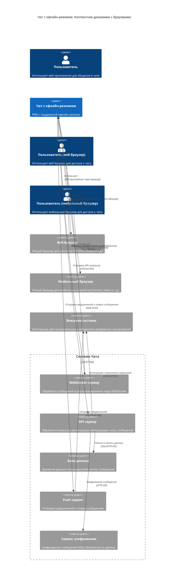

## C4 Context Diagram чата с офлайн-режимом

```mermaid
%% C4 Context Diagram: Чат с офлайн-режимом (с веб и мобильным браузером)

C4Context
    title Чат с офлайн-режимом: Контекстная диаграмма с браузерами

    Person(user, "Пользователь", "Использует веб-приложение для общения в чате")

    System(chatApp, "Чат с офлайн-режимом", "PWA с поддержкой офлайн-режима")
    System_Boundary(s1, "Система Чата") {
        System_Ext(webServer, "WebSocket сервер", "Обработка сообщений в реальном времени через WebSocket")
        System_Ext(apiServer, "API сервер", "Обработка запросов: регистрация, авторизация, чаты, сообщения")
        System_Ext(database, "База данных", "Хранение данных пользователей, чатов, сообщений")
        System_Ext(pushService, "Push сервис", "Отправка уведомлений о новых сообщениях")
        System_Ext(encryptionService, "Сервис шифрования", "Шифрование сообщений (AES), безопасность данных")
    }

    Person(webUser, "Пользователь (веб-браузер)", "Использует веб-браузер для доступа к чату")
    Person(mobileUser, "Пользователь (мобильный браузер)", "Использует мобильный браузер для доступа к чату")

    System_Ext(webBrowser, "Веб-браузер", "Общий браузер для десктопа (Chrome, Firefox и т.д.)")
    System_Ext(mobileBrowser, "Мобильный браузер", "Общий браузер для мобильных устройств (Chrome, Safari и т.д.)")

    Rel(webUser, webBrowser, "Использует", "Через веб-браузер")
    Rel(mobileUser, mobileBrowser, "Использует", "Через мобильный браузер")
    Rel(webBrowser, chatApp, "Использует", "Веб-приложение через браузер")
    Rel(mobileBrowser, chatApp, "Использует", "Мобильное веб-приложение через браузер")

    Rel(chatApp, apiServer, "Отправка API-запросов", "HTTP/HTTPS")
    Rel(chatApp, webServer, "Обмен сообщениями через WebSocket", "WebSocket")
    Rel(apiServer, database, "Чтение и запись данных", "SQL/HTTP API")
    Rel(webServer, chatApp, "Реальное время сообщений", "WebSocket")
    Rel(chatApp, pushService, "Отправка уведомлений о новых сообщениях", "Web Push")
    Rel(apiServer, encryptionService, "Шифрование сообщений", "HTTP API")

    System_Ext(externalSystem, "Внешняя система", "Интеграция для синхронизации сообщений и резервного копирования")
    Rel(apiServer, externalSystem, "Интеграция с внешними сервисами", "HTTP/HTTPS")
    Rel(pushService, externalSystem, "Отправка уведомлений", "Web Push API")

```